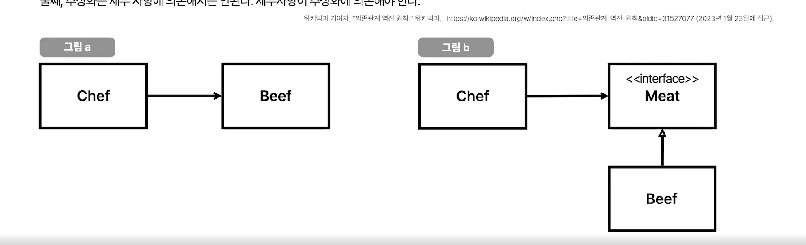

## 5~6강 의존성과 Testability

`의존성`  
* 의존성 ~ 커플링 ~ 다른 객체나 함수를 사용한 상태
* 의존성 주입 ~ 의존성을 약하게 하는것 ,.
*  new 는 하드 코딩이다 ..!
   
> DI   
Dependency Injection 의존성 주입  
Dependency Inversion 의존성 역전 ~ DIP라고 생각해  !

*  의존성 역전은 상위 모듈은 하위 모듈에 의존하는게 아니라 상위 모듈 하위 모듈 모두 추상화의 의존하는것..!

`의존성과 테스트`  
1부 강의 참고 ... 시간기록같은것을 테스트 해보는것..    

* 추상화의 의존하면 배포환경과 테스트환경을 분리 할 수 있다 ...! 
* 다형성의 원리를 이용 갈아 끼울수 있기 때문에..!

`테스트빌리티`  
 얼마나 쉽게 input을 변경하고 output을 쉽게 검증할 수 있는가 ?  
* input을 알가쉽다는건.. 호출자가 메소드 호출시 내부 로직 몰라도 되는것.. 캡슐화!
* 하드코딩으로 뭔가 박혀있는것... 외부클라....를 직접사용할때도 .?~
* output을 알기쉽다는건 .. 외부에서 결과를 볼 수 있는것..
